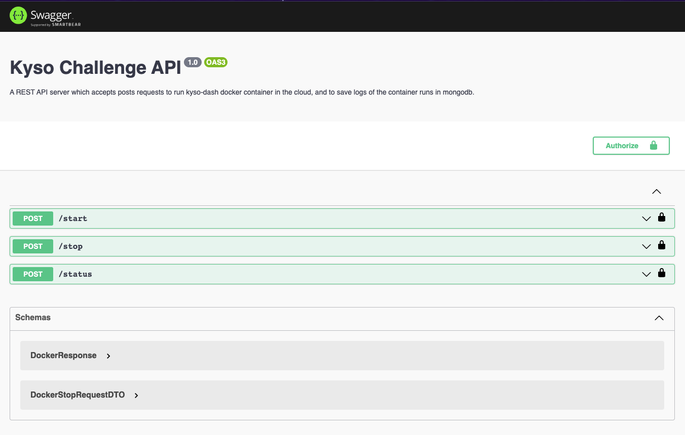
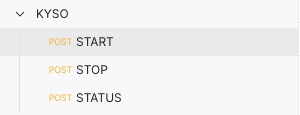
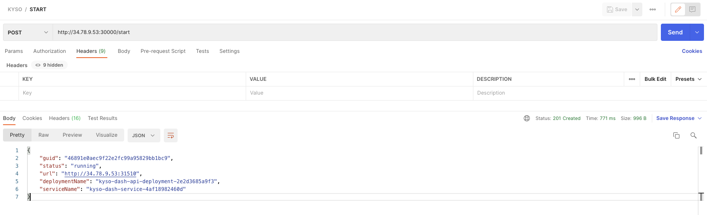
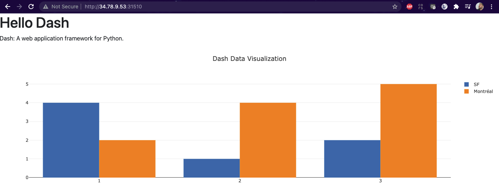
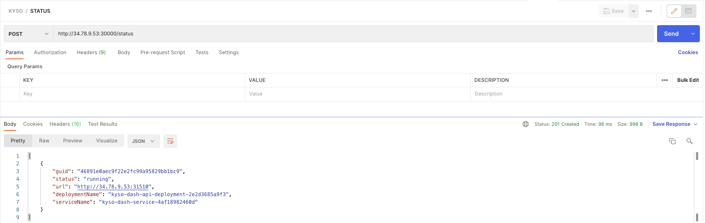
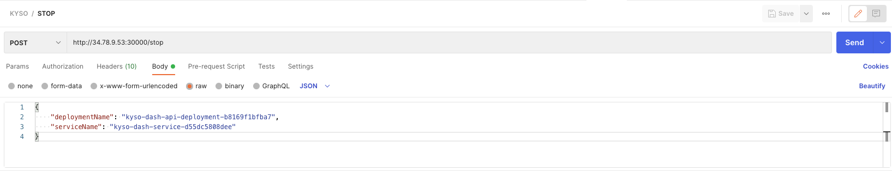
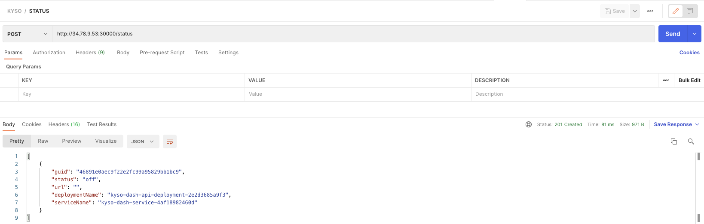
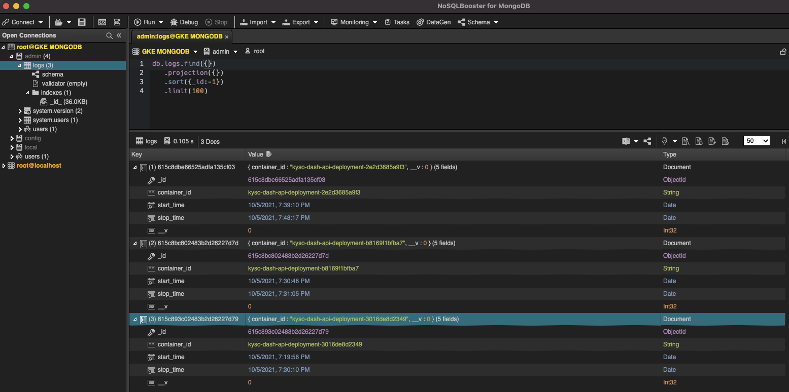

# K8s Challenge

Code of the challenge launched by Kyso

## GKE

The API can be attacked publicly, as it allocated in [http://34.78.9.53:30000/](http://34.78.9.53:30000/).

Swagger should be avaible at [http://34.78.9.53:30000/api](http://34.78.9.53:30000/api), but GKE is redirecting to https, and as I have not a valid certificate, the swagger page is not rendered properly.



In any case, I prepared a Postman collection to attack the API. Please, import the file KYSO.postman_collection.json into Postman, you should get something similar to this



To execute the **START** endpoint, just launch a POST without any parameter, you should receive a response like this:



```json
{
    "guid": "46891e0aec9f22e2fc99a95829bb1bc9",
    "status": "running",
    "url": "http://34.78.9.53:31510",
    "deploymentName": "kyso-dash-api-deployment-2e2d3685a9f3",
    "serviceName": "kyso-dash-service-4af18982460d"
}
```

Every time a START endpoint is called, a new instance of the kyso-dash image is created and exposed to the internet using a different port. The deployment is automatized in Kubernetes, with the names specified in the properties deploymentName and serviceName.

Put the address in the property url in your browser and check that you can see something similar to:



Once a deployment is made, you can check the status executing the STATUS endpoint without any parameter



And you can undeploy an instance using the STOP endpoint, passing the deploymentName and serviceName of the deployment you want to undeploy



If you check the STATUS again, you will se that the deployment was stopped successfully



## MongoDB

MongoDB is exposed through the internet using the following parameters

```
MONGO_HOST=34.78.9.53
MONGO_PORT=32546
MONGO_USER=root
MONGO_PASSWORD=secret
MONGO_PATH=admin
```

**Side note**: I know the security here is reeeally bad... in production will be sooo different ;)

I use NoSQLBooster for MongoDB as GUI, but you can use whatever you feel more comfortable


